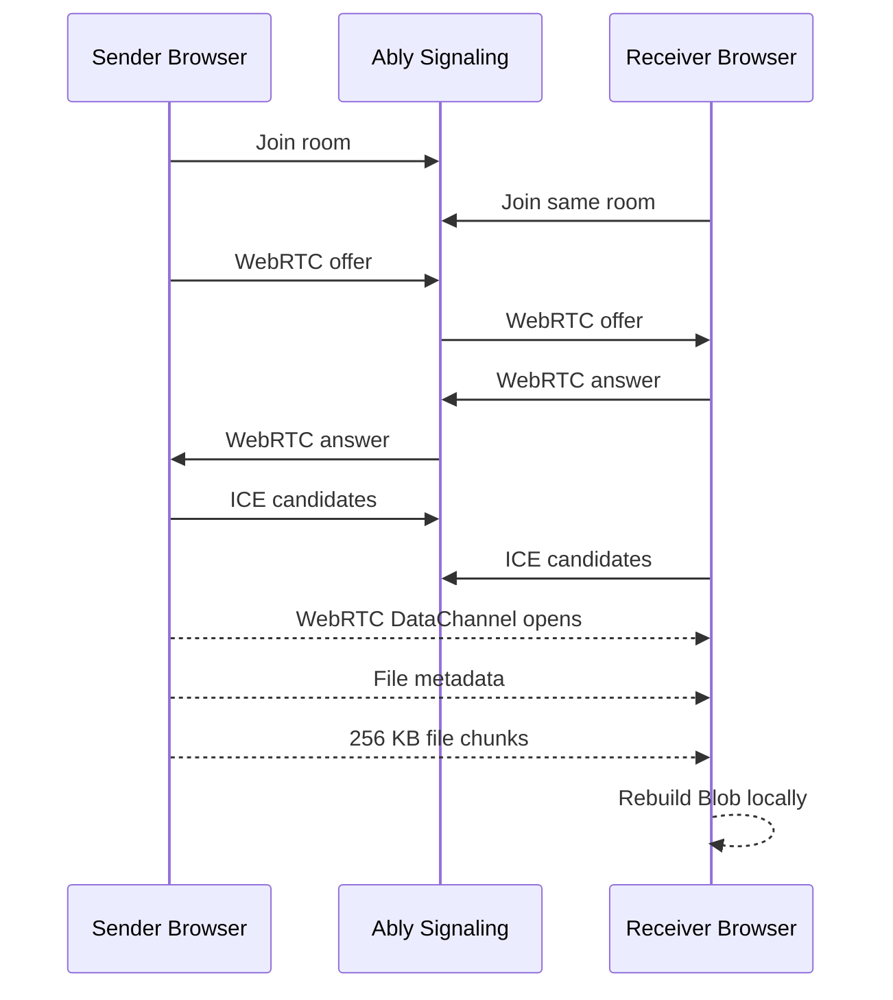

<p align="center">
  
</p>

<h1 align="center">🌊 Drift Transfer</h1>

<p align="center">
  <strong>Free, open-source peer-to-peer file transfer for the browser.</strong>
</p>

<p align="center">
  Send large files directly from one browser to another with WebRTC DataChannels.
  No accounts. No database. No server-side file storage.
</p>

<p align="center">
  <a href="https://github.com/antho8101/Drift-Transfer">Repository</a>
  ·
  <a href="https://github.com/antho8101">Anthony on GitHub</a>
  ·
  <a href="https://github.com/sponsors/antho8101">Sponsor the project</a>
</p>

<p align="center">
  
  
  
  
</p>

---

## ✨ What Is Drift Transfer?

Drift Transfer is a minimal, premium, dark-mode file transfer webapp built around one simple idea:

> A file should feel like it drifts from one computer to another.

The app creates a temporary room, connects two browsers with WebRTC, then sends the file directly through a DataChannel. Ably is used only for signaling, meaning it helps browsers exchange connection information but does not transport the file itself.

This makes Drift Transfer a lightweight, privacy-conscious alternative to traditional upload-and-share tools.

## 🚀 Highlights

- **💸 100% free**: no pricing tiers, no locked features, no account wall.
- **⚡ Peer-to-peer transfer**: files move directly between browsers using WebRTC DataChannels.
- **🔒 No server-side storage**: Drift Transfer does not upload, store, index, or process file contents.
- **🛰️ Ably for signaling only**: offer, answer, ICE candidates, and room presence.
- **📦 Large-file friendly**: files are sent in 256 KB chunks with DataChannel backpressure handling.
- **🌙 Premium dark UI**: calm, animated, responsive interface inspired by modern product tools.
- **🌍 Open source**: simple stack, readable codebase, and contribution templates included.
- **▲ Vercel-ready**: deployable as a standard Next.js app.

## 🧭 How It Works



Ably never receives the file payload. It only carries the small signaling messages required to establish the peer-to-peer WebRTC connection.

## 🧪 Product Flow

1. 🚪 User A opens the homepage.
2. ✨ User A clicks **Start transfer**.
3. 🔗 Drift Transfer creates a short room link.
4. 📩 User A shares the link with User B.
5. 🛰️ Both browsers exchange WebRTC signaling through Ably.
6. ⚡ A WebRTC DataChannel named `file-transfer` opens.
7. 📦 User A selects or drops a file.
8. 🌊 The file is sent in chunks directly to User B.
9. ⬇️ User B downloads the reconstructed file.

## 🛠️ Tech Stack

| Layer | Technology |
| --- | --- |
| Framework | Next.js App Router |
| Language | TypeScript |
| Styling | Tailwind CSS |
| Signaling | Ably Realtime |
| Transfer | WebRTC DataChannel |
| Hosting | Vercel |
| Storage | None |
| Auth | None |
| Database | None |

## 📁 Project Structure

```text
app/
  globals.css
  layout.tsx
  page.tsx
  room/[roomId]/page.tsx

components/
  DropZone.tsx
  ProgressBar.tsx
  RoomClient.tsx
  StartTransferButton.tsx
  StatusBadge.tsx

lib/
  ably.ts
  fileTransfer.ts
  utils.ts
  webrtc.ts

public/
  drift_transfer_logo.svg
  favicon.svg
```

## ⚙️ Getting Started

### 1. Clone The Repository

```bash
git clone https://github.com/antho8101/Drift-Transfer.git
cd Drift-Transfer
```

### 2. Install Dependencies

```bash
npm install
```

### 3. Create Your Environment File

Create `.env` in the project root:

```env
NEXT_PUBLIC_ABLY_API_KEY=your_ably_api_key_here
```

### 4. Run Locally

```bash
npm run dev
```

Open `http://localhost:3000`, start a room, then open the invite link in another browser, private window, or device.

## 🛰️ Ably Setup

Drift Transfer needs Ably only to exchange WebRTC signaling messages.

1. Create an account at [ably.com](https://ably.com).
2. Create a new Ably app.
3. Open the Ably app dashboard.
4. Copy an API key.
5. Add it to `.env`:

```env
NEXT_PUBLIC_ABLY_API_KEY=your_ably_api_key_here
```

Required Ably capabilities:

- `publish`
- `subscribe`
- `presence`

For this MVP, the browser reads `NEXT_PUBLIC_ABLY_API_KEY` directly. That means the key should be treated as public. For a larger production launch, scoped token authentication from a server route would be a better security model.

## 📦 File Transfer Details

The transfer layer is intentionally simple:

- DataChannel name: `file-transfer`
- Chunk size: `256 KB`
- Metadata sent before chunks:
  - filename
  - filetype
  - filesize
- Backpressure handling:
  - the sender watches `dataChannel.bufferedAmount`
  - sending pauses when the buffer is too full
  - sending resumes when `bufferedamountlow` fires

This keeps the MVP understandable while still making it practical for large files.

## 🔐 Privacy Model

Drift Transfer is designed to avoid server-side file handling.

The app does **not**:

- upload files to a backend;
- store files in a database;
- create user accounts;
- track transfer history;
- keep downloadable links after the session;
- provide server-side file recovery.

The file exists in the sender browser, travels through the WebRTC DataChannel, then is reconstructed in the receiver browser.

## ▲ Deploy On Vercel

1. Push the repository to GitHub.
2. Import it into [Vercel](https://vercel.com).
3. Add the environment variable:

```env
NEXT_PUBLIC_ABLY_API_KEY=your_ably_api_key_here
```

4. Deploy.

That is it. No database, no bucket, no server-side storage.

## 🧪 Scripts

```bash
npm run dev
npm run lint
npm run build
npm run start
```

## ⚠️ Known Limitations

Drift Transfer is currently an MVP. Some limitations are expected:

- Some restrictive networks may require a TURN server.
- Transfers stop if either browser tab is closed.
- Resume and partial retry are not included yet.
- Very large transfers depend on browser memory and network stability.
- Public Ably keys are acceptable for the MVP but token auth is better for serious production scale.
- Mobile browsers may behave differently with background tabs and long transfers.

## 🗺️ Roadmap Ideas

Possible future improvements:

- 🧭 Optional TURN server configuration
- 🔁 Transfer resume experiments
- 🧩 Multi-file transfers
- 📱 Better mobile transfer states
- 🧯 More detailed connection troubleshooting
- 🔐 Ably token authentication
- 📊 Transfer speed and ETA
- ♿ Accessibility improvements
- 🌍 Internationalization
- 🧪 Automated WebRTC flow testing

## 🤝 Contributing

Contributions are welcome.

Before opening a pull request, please read:

- `CONTRIBUTING.md`
- `CODE_OF_CONDUCT.md`
- `SECURITY.md`

Good first contributions include:

- improving empty states;
- improving error messages;
- polishing mobile UI;
- documenting edge cases;
- testing different browsers and networks;
- refining the landing page experience.

Please run before submitting:

```bash
npm run lint
npm run build
```

## 🧵 Repository Topics

Suggested GitHub topics:

```text
webrtc
file-transfer
peer-to-peer
p2p
nextjs
typescript
ably
datachannel
privacy
vercel
```

Suggested short repository description:

```text
Free peer-to-peer file transfer in the browser. WebRTC-powered, no accounts, no server-side file storage.
```

## 💜 Support

Drift Transfer is free and open source. If it helps you, saves you time, or you simply want to support more public tools, you can sponsor Anthony here:

👉 [github.com/sponsors/antho8101](https://github.com/sponsors/antho8101)

Every contribution helps keep projects like this free, polished, and open.

## 📄 License

MIT. See `LICENSE`.

---

<p align="center">
  Made with ❤ by <a href="https://github.com/antho8101">Anthony</a>.
</p>
